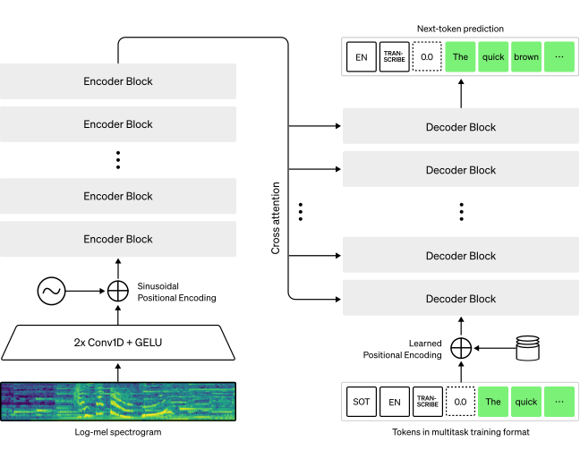

## Presentation is Available Online

[https://software-mansion-labs.github.io/rtc-on-ai-workshops](https://software-mansion-labs.github.io/rtc-on-ai-workshops)

# On-Device AI Revolution

---

## What is On-Device AI?

**On-Device AI** = Running artificial intelligence models directly on user devices (phones, laptops, embedded systems) instead of cloud servers.

**Key Characteristics:**

- **Local processing** - Computation happens on your device
- **No internet required** - Works completely offline
- **Edge computing** - Brings AI closer to the user
- **Model optimization** - Compressed models for resource constraints

---

## Why On-Device AI is Revolutionary

**Performance Benefits:**

- **Ultra-low latency** - No network round trips (100ms vs up to few seconds)
- **Always available** - Works without internet connectivity
- **Real-time processing** - Instant responses for interactive applications

**Privacy & Security:**

- **Data never leaves device** - Complete privacy by design
- **No data breaches** - Nothing to hack if data isn't transmitted
- **GDPR/compliance friendly** - Minimal data collection requirements

---

## Why On-Device AI is Revolutionary

**Cost Benefits:**

- **No API fees** - One-time model download vs per-request costs
- **Reduced bandwidth** - Lower data usage
- **Scalable economics** - Cost doesn't increase with usage

---

## The Dark Side: When On-Device AI Fails

**Technical Limitations:**

- **Model size constraints** - Limited memory/storage on devices
- **Computational limits** - Can't run largest, most capable models
- **Battery drain** - Intensive AI processing consumes power
- **Heat generation** - Sustained AI workloads can cause thermal throttling

**Quality Trade-offs:**

- **Smaller models = lower accuracy** - GPT-5 vs mobile-optimized models
- **Limited context** - Shorter conversation memory
- **Slower updates** - Model improvements require app updates

## The Dark Side: When On-Device AI Fails

**Development Challenges:**

- **Platform fragmentation** - iOS, Android, different chips
- **Model optimization complexity** - Quantization, pruning, distillation
- **Testing complexity** - Many device configurations to support

---

## On-Device AI in the Wild: Current Applications

**Smartphones:**

- **Apple Siri** - Voice processing, on-device in iOS 15+
- **Google Pixel** - Live translation, call screening, photo enhancement
- **Samsung Galaxy** - Real-time language translation, camera AI

**Consumer Electronics:**

- **Tesla Autopilot** - Real-time driving decisions
- **Ring Doorbells** - Local person/package detection
- **Smart TVs** - Content recommendation, voice control

<br>

**And many more...**

---

## Hardware Enablers: The Silicon Revolution

**Mobile Processors:**

- **Apple A18/M-series** - 35 TOPS Neural Engine
- **Qualcomm Snapdragon** - Hexagon AI processors
- **Google Tensor** - Custom TPU for Pixel devices

**Desktop/Laptop:**

- **Apple Silicon M1/M2/M3** - Unified memory, Neural Engine
- **Intel Core Ultra** - Built-in NPU (Neural Processing Unit)
- **AMD Ryzen AI** - Dedicated AI acceleration

<br>

**Key Trend:** Every new processor includes dedicated AI acceleration hardware

---

## Setup
- Clone the repository: [https://github.com/software-mansion-labs/rtc-on-ai-workshops](https://github.com/software-mansion-labs/rtc-on-ai-workshops)
- Download `llama-3.2-1B/original/llama3_2_bf16.pte` and `tokenizer.json` from our hugging-face repository: [https://huggingface.co/software-mansion/react-native-executorch-llama-3.2](https://huggingface.co/software-mansion/react-native-executorch-llama-3.2)
- Download `whisper_base_en_decoder_xnnpack.pte`, `whisper_base_en_encoder_xnnpack.pte` and `tokenizer.json` from our whisper hugging-face repository: [https://huggingface.co/software-mansion/react-native-executorch-whisper-base.en](https://huggingface.co/software-mansion/react-native-executorch-whisper-base.en)

---

## Repository Overview
- `CMakeLists.txt` - project configuration, integration with third-party libraries
- `scripts/build.sh` - simple script containing build instructions
- `src/utils` - utilities needed for data processing
- `src/core` - main files of the project

**Move downloaded files to correct directories:**

- `models/llm/tokenizer.json`
- `models/llm/llama3_2_bf16.pte`
- `models/stt/encoder.pte`
- `models/stt/decoder.pte`
- `models/stt/tokenizer.json`
  
---

## Installing Rust (if not installed)

```bash
curl --proto '=https' --tlsv1.2 -sSf https://sh.rustup.rs | sh
```

<br>

**Don't forget to restart your terminal!**

---

## Installing Port Audio Dependency

```bash
//macOS
brew install portaudio

//Linux
sudo apt-get install portaudio19-dev

```

---

## Installing ExecuTorch
```bash
mkdir third-party

cd third-party

git clone -b release/0.7 https://github.com/pytorch/executorch.git

cd executorch
```

---

## Creating Environment
```bash
python3 -m venv .venv && source .venv/bin/activate

pip install --upgrade pip

./install_executorch.sh
```


# Deep Dive: ExecuTorch

---

## What is ExecuTorch?

**ExecuTorch** is Meta's PyTorch-based framework designed specifically for **on-device AI inference**.


**Key Characteristics:**

- **PyTorch Native** - Seamless export from PyTorch models
- **Edge Optimized** - Built for mobile, embedded, and resource-constrained devices
- **Production Ready** - C++ runtime with minimal dependencies
- **Hardware Agnostic** - Runs on CPU, GPU, NPUs, and custom accelerators

**The Problem It Solves:**

- PyTorch is great for research and training
- But too heavy for mobile/edge deployment
- ExecuTorch bridges the gap with optimized inference

---

## ExecuTorch Architecture

**Two-Phase Approach:**

```
  Developer                   End Device
┌──────────────────────┐    ┌────────────────────────────────┐
│ Python Side          │ →  │ C++ Runtime                    │
│                      │    │                                │
│ • Model Export       │    │ • Program loading              │
│ • Graph Optimization │    │ • Model Inference              │
│ • Quantization       │    │ • Memory Planning & Management │
│ • Backend Delegation │    │ • Hardware Acceleration        │
└──────────────────────┘    └────────────────────────────────┘
```

<br>

**Key Benefits:**

- **Optimized format** - `.pte` files are compact and fast to load
- **Minimal runtime** - C++ runtime has no Python dependencies

---

## Hardware Backend System

**Pluggable Backend Architecture:**

```
┌───────────────────────────┐      ┌─────────────────────┐      ┌───────────────────────────┐
│       .pte program        │  →   │  ExecuTorch Runtime │  →   │   Hardware Backend        │
│                           │      │                     │      │                           │
│   • Operators (graph)     │      │ • Program Loader    │      │ • CPU (default)           │
│   • Parameters (weights)  │      │ • Scheduler         │      │ • XNNPACK (CPU optimized) │
└───────────────────────────┘      │ • Memory Planner    │      │ • CoreML (Apple)          │
                                   │ • Delegation Layer  │      │ • QNN (Qualcomm)          │
                                   └─────────────────────┘      │ • Custom Backends         │
                                                                └───────────────────────────┘                           
```

<br>

**Popular Backends:**

- **XNNPACK** - Optimized CPU inference (what we use)
- **CoreML** - Apple Neural Engine acceleration  
- **QNN** - Qualcomm Snapdragon NPU

# What will we build?

---

## Creating Simple Model

```python
//example.py
import torch

class SimpleModel(torch.nn.Module):
    def __init__(self):
        super().__init__()

    def forward(self, x):
        return torch.sum(x)


model = SimpleModel().eval()
inputs = (torch.ones(2),)
outputs = model(*inputs)

print(f"Model outputs: {outputs}")
```

## Creating Exported Graph

```python
//example.py
from executorch.backends.xnnpack.partition.xnnpack_partitioner import XnnpackPartitioner
from executorch.exir import to_edge_transform_and_lower
from torch.export import Dim, export

exported_program = export(model, inputs)
print(exported_program)
```

## Creating ExecuTorch Program

```python
//example.py
executorch_program = to_edge_transform_and_lower(
    exported_program, partitioner=[XnnpackPartitioner()]
).to_executorch()

print(executorch_program.executorch_program)

with open("model.pte", "wb") as file:
    file.write(executorch_program.buffer)
```

## Running Exported Model

```python
//example.py
from executorch.runtime import Runtime

runtime = Runtime.get()

input_tensor = torch.ones(2)
program = runtime.load_program("model.pte")
method = program.load_method("forward")

outputs = method.execute([input_tensor])
print(f"Runtime outputs: {outputs[0]}")
```


# Introducing ExecuTorch C++ API

---

## ExecuTorch C++ Core Components

**Three Essential Classes:**

- **`executorch::extension::Module`** - Model loading and execution
- **`executorch::extension::TensorPtr`** - Tensor creation and management
- **`executorch::runtime::Error`** - Comprehensive error handling

<br>

**Key Design Principles:**

- **RAII pattern** - Automatic resource management
- **Minimal overhead** - Optimized for mobile/edge deployment
- **Type safety** - Strong typing prevents runtime errors
- **Memory efficient** - Zero-copy operations where possible

---

## The Module Class: Your Gateway to AI

**`executorch::extension::Module`** is the primary interface for loading and running ExecuTorch models.

```cpp
#include <executorch/extension/module/module.h>

// Load a model from .pte file
std::unique_ptr<executorch::extension::Module> module =
    std::make_unique<executorch::extension::Module>(
        "model.pte",
        executorch::extension::Module::LoadMode::MmapUseMlockIgnoreErrors
    );

// Load the forward method
auto result = module->load_method("forward");
if (result != executorch::runtime::Error::Ok) {
    std::cerr << "Failed to load method" << std::endl;
}

// Check if method is loaded
bool loaded = module->is_method_loaded("forward");
```

---

## Module: Loading Strategies

**Different loading modes for different use cases:**

```cpp
// Memory mapping (recommended for large models)
executorch::extension::Module::LoadMode::MmapUseMlockIgnoreErrors

// File loading (simpler, more compatible)
executorch::extension::Module::LoadMode::File

// Buffer loading (for embedded data)
executorch::extension::Module::LoadMode::Buffer
```

<br>

**Best Practices:**

- **Use RAII** - Store in `std::unique_ptr` for automatic cleanup
- **Check load results** - Always verify `load_method()` return codes
- **Mmap for large models** - Better memory efficiency for >100MB models
- **One module per model** - Don't reuse Module objects for different models

---

## Module: Running Inference

**Two execution patterns:**

```cpp
// Method 1: Direct forward() call
auto outputs = module->forward({input1, input2, input3});
if (outputs.ok()) {
    auto result_tensor = outputs.get()[0].toTensor();
    // Process result...
}

// Method 2: Execute by method name
auto outputs = module->execute("forward", {input1, input2});
if (outputs.ok()) {
    auto logits = outputs.get()[0].toTensor();
    // Process logits...
}
```

<br>

**Key Points:**

- **Inputs as vector** - Pass `std::vector<executorch::runtime::EValue>`
- **Outputs as Result** - Always check `.ok()` before accessing data
- **Multiple outputs** - Access via index: `outputs.get()[0]`, `outputs.get()[1]`

---

## Tensor Management: TensorPtr

**`executorch::extension::TensorPtr`** provides efficient tensor creation and memory management.

```cpp
#include <executorch/extension/tensor/tensor.h>

// Create tensor from data
std::vector<float> data = {1.0f, 2.0f, 3.0f, 4.0f};
std::vector<int32_t> shape = {2, 2};

auto tensor = executorch::extension::make_tensor_ptr(
    std::move(shape),
    std::move(data)
);

// Create tensor from blob (zero-copy)
int64_t token_data[] = {123, 456, 789};
auto token_tensor = executorch::extension::from_blob(
    token_data,
    {1, 3},
    executorch::aten::ScalarType::Long
);
```

---

## Tensor: Data Types and Shapes

**Common scalar types for different use cases:**

```cpp
// Integer types
executorch::aten::ScalarType::Long     // int64_t - for tokens, indices
executorch::aten::ScalarType::Int      // int32_t - for smaller integers

// Floating point types
executorch::aten::ScalarType::Float    // float32 - most common for models
executorch::aten::ScalarType::Double   // float64 - high precision
executorch::aten::ScalarType::Half     // float16 - memory efficient

// Example usage
auto float_tensor = executorch::extension::from_blob(
    audio_data.data(),
    {batch_size, sequence_length},
    executorch::aten::ScalarType::Float
);
```

<br>

**Shape specification:**

- Use `std::vector<executorch::aten::SizesType>` or `{dim1, dim2, dim3}`
- Batch dimension typically first: `{batch, height, width, channels}`

---

## Tensor: Memory Management Patterns

**Two creation patterns for different use cases:**

```cpp
// Pattern 1: move_tensor_ptr (takes ownership)
std::vector<float> owned_data = {1.0f, 2.0f, 3.0f};
auto tensor1 = executorch::extension::make_tensor_ptr(
    {3}, std::move(owned_data)  // Data moved into tensor
);

// Pattern 2: from_blob (references existing data)
float stack_data[] = {1.0f, 2.0f, 3.0f};
auto tensor2 = executorch::extension::from_blob(
    stack_data, {3}, executorch::aten::ScalarType::Float
);
// Warning: stack_data must outlive tensor2!
```

<br>

**Memory Safety Rules:**

- **from_blob**: Ensure source data outlives tensor
- **make_tensor_ptr**: Safe - tensor owns the data (not always :/)
- **Zero-copy when possible**: Use `from_blob` for performance

---

## Error Handling: The Result Pattern

**ExecuTorch uses `Result<T>` for error handling:**

```cpp
#include <executorch/runtime/core/error.h>

// Method returns Result<std::vector<EValue>>
auto inference_result = module->forward({input_tensor});

// Always check before accessing
if (inference_result.ok()) {
    // Success path
    auto outputs = inference_result.get();
    auto tensor = outputs[0].toTensor();

} else {
    // Error path
    executorch::runtime::Error error = inference_result.error();
    std::cerr << "Inference failed with error code: "
              << static_cast<int>(error) << std::endl;
}
```

---

## Error Handling: Common Error Codes

**Key error codes and their meanings:**

```cpp
executorch::runtime::Error::Ok                    // Success
executorch::runtime::Error::InvalidArgument       // Bad input parameters
executorch::runtime::Error::InvalidState          // Module not loaded properly
executorch::runtime::Error::NotFound              // Method/file not found
executorch::runtime::Error::OutOfMemory          // Insufficient memory
executorch::runtime::Error::NotSupported         // Unsupported operation
executorch::runtime::Error::Internal             // Internal framework error
```

<br>

**Best Practice Error Handling:**

```cpp
auto result = module->load_method("forward");
if (result != executorch::runtime::Error::Ok) {
    switch (result) {
        case executorch::runtime::Error::NotFound:
            std::cerr << "Method 'forward' not found in model" << std::endl;
            break;
        case executorch::runtime::Error::InvalidState:
            std::cerr << "Module not properly initialized" << std::endl;
            break;
        default:
            std::cerr << "Unknown error: " << static_cast<int>(result) << std::endl;
    }
    return false;
}
```

---

## Run Simple Model in C++

**Exercise 0:** Remember the model we exported in previous section, let's run it in C++.

1. Load the model with ExecuTorch `Module`
2. Create a tensor with a shape and type accepted by the model
3. Execute the model
4. Add error handling

---

## Solution

```cpp
//src/main.cpp
int main() {
  std::unique_ptr<executorch::extension::Module> module =
      std::make_unique<executorch::extension::Module>(
          "model.pte",
          executorch::extension::Module::LoadMode::MmapUseMlockIgnoreErrors);

  std::vector<float> data = {1.0f, 2.0f};

  auto tensor = executorch::extension::from_blob(
      data.data(), {2}, executorch::aten::ScalarType::Float);

  auto result = module->forward(tensor);
  auto result_tensor = result.get()[0].toTensor();

  std::cout << result_tensor.data_ptr<float>()[0] << std::endl;

  return 0;
}
```

<br>

Build the project: `./scripts/build.sh`

And run: `./build/rtc_on_workshops`

**Expected Result:** `3`

---

## Loading the Model in C++

```cpp
//src/main.cpp
#include "core/audio/audio_recorder.h"
#include "core/llm/llm_runner.h"
#include "core/stt/speech_to_text.h"
#include <executorch/extension/module/module.h>
#include <executorch/extension/tensor/tensor.h>
#include <iostream>

using namespace rtc_runner;

int main(){
  std::unique_ptr<executorch::extension::Module> module =
      std::make_unique<executorch::extension::Module>(
          "models/llm/llama3_2_bf16.pte");

  module->load_method("forward");
}
```

## Running the Model in C++

```cpp
//src/main.cpp
int64_t start_pos = 0;
int64_t cur_token = 100;

auto tokens = executorch::extension::from_blob(
    &cur_token, {1, 1}, executorch::aten::ScalarType::Long);
auto start_pos_tensor = executorch::extension::from_blob(
    &start_pos, {1}, executorch::aten::ScalarType::Long);

auto logits_res = module->forward({tokens, start_pos_tensor});

executorch::aten::Tensor final_logits = logits_res.get()[0].toTensor();
std::cout << final_logits.numel() << std::endl;

return 0;
```

<br>

Build the project: `./scripts/build.sh`

And run: `./build/rtc_on_workshops`

Expected Result: `128256` -- number of tokens in the model's vocabulary

# Understanding the LLMs

---

## What is LLM?
- __Statistical text predictor__ - predicts the next word given context
- __Transformer architecture__ - processes text in parallel, not sequentially
- __Autoregressive generation__ - generates one token at a time, using previous tokens as context

---

## The Text Processing Pipeline

```python
"Hello, how are you?" 
    ↓ Tokenization
[15496, 11, 1268, 527, 499, 30]
    ↓ Model Processing  
[0.2, 0.1, 0.05, 0.4, 0.15, ...]
    ↓ Decoding
"I'm"
```

# Step 1: Tokenization

---

## What is Token?
- __Subword units__ - smaller than words, larger than characters
- Examples:
  - "hello" -> [15496]
  - "unhappy" -> [359, 57621] ("un" + "happy")

---

## Why Tokenization Matters?
- __Fixed vocabulary size__ (around 100k tokens)
- __Handles unknown words__ through subwords
- __Language agnostic__ - works for any language

---

## Tokenization in Practice

```cpp
//src/main.cpp
#include "core/tokenization/tokenizer_adapter.h"

int main(){
  std::unique_ptr<TokenizerAdapter> tokenizer_;
  tokenizer_ = std::make_unique<TokenizerAdapter>("models/llm/tokenizer.json");

  const std::vector<uint64_t> prompt_tokens =
      tokenizer_->encode("Hello, how are you?");

  for (uint64_t t : prompt_tokens) {
    std::cout << t << " ";
    std::cout << tokenizer_->decode(t) << std::endl;
  }

  return 0;
}
```

<br>

Build the project: `./scripts/build.sh`

And run: `./build/rtc_on_workshops`

# Step 2: The Transformer Architecture

---

## Key components
- __Embeddings__ - Convert tokens to vectors
- __Attention Layers__ - Focus on relevant parts of input

---

## What Happens Inside
1. **Token** -> **Vector** (embedding)
2. **Multiple transformer layers process the vectors**
3. **Final layer** -> Probability distribution over vocabulary

---
   
## Self-Attention: The Magic Behind LLMs

```
Input: "The cat sat on the"
       ↓ Self-Attention
"cat" looks at: [The] - understands it's the subject  
"sat" looks at: [The, cat] - learns it's an action
```
\

__Result__: Each word understands its context relative to all previous words

__Why This Matters__: The model builds rich representations that capture meaning and relationships

# Step 3: Text Generation

---

## Autoregressive Generation

```
Prompt: "The weather today is"

Step 1: Model processes "The weather today is"
       → Predicts "sunny" (highest probability)
       
Step 2: Model processes "The weather today is sunny"  
       → Predicts "and" (highest probability)
       
Step 3: Model processes "The weather today is sunny and"
       → Predicts "warm" (highest probability)
```

---

## Probability and Sampling
#### Model Output (Logits)

```
Input: "My favorite color is"
Model output probabilities:
- "blue": 0.35
- "red": 0.25  
- "green": 0.20
- "purple": 0.15
- "yellow": 0.05
```
\

#### Sampling Strategies
- __Greedy__: Always pick highest probability (deterministic)
- __Top-k__: Sample from top k most likely tokens
- __Temperature__: Control randomness (low = more predictable)

# Step 4: Optimization techniques

--- 

## The Problem: Naive Text Generation

#### Without Optimization

```
Conversation:
User: "Hello"
Bot: "Hi there!"
User: "How are you?"

Generation Process:
Step 1: Process "Hello" → generate "Hi"
Step 2: Process "Hello Hi" → generate "there"  
Step 3: Process "Hello Hi there" → generate "!"
Step 4: Process "Hello Hi there ! How" → generate "I'm"
Step 5: Process "Hello Hi there ! How I'm" → generate "good"
```
<br>

__Problem:__ Each step recomputes attention for **ALL** previous tokens!

---

## What is Key-Value Cache?

In transformer attention, each token creates:

- __Key (K):__ "What am I about?"
- __Value (V):__ "What information do I contain?"
- __Query (Q):__ "What am I looking for?"

<br>

__Key Insight:__ Keys and Values don't change once computed - we can store them!

## How KV Cache Works:
```python
Turn 1: Input "Hello"
   - Compute K₁, V₁ for "Hello"
   - Store in cache: [K₁, V₁]
   - Generate: "Hi"

Turn 2: Input "Hi" 
   - Compute K₂, V₂ for "Hi" only
   - Cache now: [K₁, V₁, K₂, V₂]
   - Attention uses ALL cached K,V pairs
   - Generate: "there"

Turn 3: Input "there"
   - Compute K₃, V₃ for "there" only  
   - Cache now: [K₁, V₁, K₂, V₂, K₃, V₃]
   - Generate: "!"
```

---

## What is Prefilling?

__Prefilling__ = Processing the initial prompt all at once

```python
User Input: "Explain machine learning in simple terms"
                    ↓ PREFILLING PHASE
Process all 6 tokens simultaneously:
- Token 1: "Explain" → K₁, V₁
- Token 2: "machine" → K₂, V₂  
- Token 3: "learning" → K₃, V₃
- Token 4: "in" → K₄, V₄
- Token 5: "simple" → K₅, V₅
- Token 6: "terms" → K₆, V₆

Cache after prefill: [K₁,V₁, K₂,V₂, K₃,V₃, K₄,V₄, K₅,V₅, K₆,V₆]
First generated token: "Machine"
```

---

## Autoregressive Generation with Cache

```python
Cache from prefill: [K₁,V₁, K₂,V₂, K₃,V₃, K₄,V₄, K₅,V₅, K₆,V₆]

Generation Loop:
Iteration 1: Process "Machine" → K₇,V₇ → Generate "learning"
Iteration 2: Process "learning" → K₈,V₈ → Generate "is"  
Iteration 3: Process "is" → K₉,V₉ → Generate "a"
...

Each iteration:
- Process only 1 new token
- Reuse entire cache from previous iterations
- Append new K,V to cache
```

<br>

__Key Difference:__ Prefill = parallel, Generation = sequential

---

## Performance Comparision

__Without KV Cache__
```python
Prompt: 10 tokens, Generate: 50 tokens
Total computations: 10 + 11 + 12 + ... + 60 = 1,750 operations
```

<br>

__With KV Cache__
```python
Prompt: 10 tokens, Generate: 50 tokens
Prefill: 10 operations (parallel)
Generation: 50 operations (1 per token)
Total: 60 operations
```

<br>

__Speedup: 1,750 / 60 = 29x faster!__

---

## Quantization

**What is Quantization?**

- **Precision reduction** - Converting from higher to lower precision data types
- **Weight compression** - Storing model parameters in fewer bits
- **Memory savings** - Significant reduction in model size and RAM usage
- **Speed improvements** - Faster inference on compatible hardware

**Common Quantization Types:**

- **FP32 → FP16** - Half precision (2x compression)
- **FP32 → INT8** - 8-bit integers (4x compression)
- **INT8 → INT4** - 4-bit quantization (8x compression)
- **Dynamic quantization** - Runtime conversion
- **Static quantization** - Pre-computed scales and zero points

---

## Quantization Trade-offs

**Benefits:**

- **Smaller models** - 2x to 8x size reduction
- **Faster inference** - Better throughput on mobile/edge devices
- **Lower memory** - Fits larger models in limited RAM
- **Energy efficient** - Reduced power consumption

**Challenges:**

- **Accuracy loss** - Some precision degradation inevitable
- **Hardware dependency** - Not all devices support all quantization types
- **Model-specific** - Different models respond differently to quantization

# Building LLM Runner

---

## Project Overview

**Architecture Components:**
```
┌─────────────────┐    ┌─────────────────┐    ┌─────────────────┐
│   Audio Input   │ -> │  Speech-to-Text │ -> │   LLM Runner    │
│   (Microphone)  │    │   (Whisper STT) │    │ (Llama 3.2 BF16)│
└─────────────────┘    └─────────────────┘    └─────────────────┘
```

<br>

**Key Features:**

- Real-time voice interaction
- LLaMA 3.2 model inference via ExecuTorch
- Optimized for local execution
- Chat template support with conversation history

---

## File Structure (`src/core/llm/`)
```python
src/core/llm/
├── llm_runner.h                # Main LLM interface
├── llm_runner.cpp              # LLM orchestration logic
├── text_prefiller.h            # Prompt prefill component
├── text_prefiller.cpp          # Prefill implementation
├── token_generator.h           # Token generation interface
├── token_generator.cpp         # Generation loop
├── chat_template.h             # Llama 3.2 chat formatting
└── chat_template.cpp           # Template implementation
```

<br>

**Dependencies:**

- ExecuTorch runtime for model execution
- Custom tokenizer adapter (based on tokenizers_cpp)
- Utility functions for token processing

# Step 1: Tokenization

---

## Tokenizer File Formats

**Common Tokenizer Formats:**

- **Hugging Face Tokenizers (.json)** - JSON-based, human-readable format
- **SentencePiece (.model)** - Google's efficient binary format
- **TikToken (.tiktoken)** - OpenAI's custom format for GPT models
- **GGUF (.gguf)** - Unified format including model + tokenizer

---

## Format Comparison

| Format | Size | Speed | Compatibility | Use Case |
|--------|------|-------|---------------|----------|
| HF JSON | Large | Medium | High | Development, debugging |
| SentencePiece | Small | Fast | Medium | Production inference |
| TikToken | Medium | Fast | Low | OpenAI models only |
| GGUF | Varies | Fast | Growing | Unified model files |

---

## TokenizerAdapter Interface

```cpp
//src/core/tokenization/TokenizerAdapter.h
class TokenizerAdapter {
public:
  explicit TokenizerAdapter(const std::string &tokenizer_path);
  
  // Core functionality
  std::vector<uint64_t> encode(const std::string &text);
  std::string decode(uint64_t token);
  
  // Special token handling
  uint64_t eos_tok() const { return eos_token_; }
  void set_eos_token(uint64_t eos_token);
  
private:
  std::shared_ptr<tokenizers::Tokenizer> tokenizer_;
  uint64_t eos_token_ = 128009; // LLaMA default EOS
};
```

# Step 2: Prompt Prefilling

---

## TextPrefiller Interface

**Handles efficient batch processing of prompt tokens:**

```cpp
//src/core/llm/text_prefiller.h
class TextPrefiller {
public:
  TextPrefiller(executorch::extension::Module *module);
  
  /**
   * Prefill an LLM Module with the given text input.
   * @param prompt_tokens The text prompt tokens encoded by tokenizer
   * @param start_pos The starting position in KV cache 
   * @return The next token after prefill
   */
  ::executorch::runtime::Result<uint64_t>
  prefill(std::vector<uint64_t> &prompt_tokens, int64_t &start_pos);

private:
  executorch::extension::Module *module_;
};
```

---

## Exercise 1: TextPrefiller Implementation

**Your Task:** Implement the `prefill()` function in
`TextPrefiller::prefill()`

**What it does:** Processes prompt tokens in parallel to
populate the KV cache and generate the first response token.

**Bonus Task:** Implement sequential version of prefilling

<br>

**Key ExecuTorch APIs you'll use:**

```cpp
module_->is_method_loaded("forward");
module_->load_method("forward");
// Create tensors from data
executorch::extension::from_blob(data, shape,
executorch::aten::ScalarType::Long);

// Execute model
module_->forward({input_tensors, pos_tensor});

// Extract token from logits
logits_to_token(logits_tensor);
```

**Expected time: 20 minutes**

---

## Testing: Prefiller

```cpp
//src/main.cpp
std::unique_ptr<executorch::extension::Module> module =
    std::make_unique<executorch::extension::Module>(
        "models/llm/llama3_2_bf16.pte");

std::unique_ptr<TextPrefiller> text_prefiller =
    std::make_unique<TextPrefiller>(module.get());

std::vector<uint64_t> prompt_tokens = {15496, 11, 1268, 527, 499};
int64_t start_pos = 0;

auto prefill_res = text_prefiller->prefill(prompt_tokens, start_pos);

if (prefill_res.ok()) {
  uint64_t next_token = prefill_res.get();
  std::cout << "Next token after prefill: " << next_token;
} else {
  std::cout << "Prefill error: " << static_cast<int>(prefill_res.error());
}
```
<br>

**Expected Result** - "Next token after prefill: 3815"

---

## Loading the Model Into Memory

```cpp
//src/core/llm/text_prefiller.cpp
if (!module_->is_method_loaded("forward")) {
  auto load_result = module_->load_method("forward");
  if (load_result != ::executorch::runtime::Error::Ok) {
    return load_result;
  }
}
```

---

## Preparing the Input

```cpp
//src/core/llm/text_prefiller.cpp
int32_t num_prompt_tokens = prompt_tokens.size();
uint64_t cur_token;

auto tokens = executorch::extension::from_blob(
    prompt_tokens.data(), {1, num_prompt_tokens},
    executorch::aten::ScalarType::Long);

auto start_pos_tensor = executorch::extension::from_blob(
    &start_pos, {1}, executorch::aten::ScalarType::Long);
```

## Computing Keys and Values for Prompt Tokens (in parallel)

```cpp
//src/core/llm/text_prefiller.cpp
auto outputs_res = module_->forward({tokens, start_pos_tensor});
if (outputs_res.error() != ::executorch::runtime::Error::Ok) {
  return outputs_res.error();
}

auto logits = outputs_res.get()[0].toTensor();
start_pos += num_prompt_tokens;
cur_token = logits_to_token(logits);

return cur_token;
```

# Step 3: Generation loop

---

## TokenGenerator Interface

**Handles autoregressive token generation with streaming:**

```cpp
//src/core/llm/token_generator/h
class TokenGenerator {
public:
  TokenGenerator(TokenizerAdapter *tokenizer,
                      executorch::extension::Module *module,
                      std::unique_ptr<std::unordered_set<uint64_t>> &&eos_ids);

  /**
   * Generate tokens autoregressively from the given input tokens.
   * @param tokens The input token sequence including prompt and any previously generated tokens
   * @param start_pos The starting position in KV cache for generation (after prefill)
   * @param token_callback Callback function called for each generated token's decoded text
   * @return The number of tokens generated, or error if generation fails
   */
  ::executorch::runtime::Result<int64_t>
  generate(std::vector<uint64_t> tokens, int64_t start_pos,
           std::function<void(const std::string &)> token_callback);

private:
  TokenizerAdapter *tokenizer_;
  executorch::extension::Module *module_;
  std::unique_ptr<std::unordered_set<uint64_t>> eos_ids_;
};
```

---

## Exercise 2: TokenGenerator Implementation

**Your Task:** Implement the `generate()` function in
`TokenGenerator::generate()`

**What it does:** Performs autoregressive token generation
loop, generating tokens one by one until EOS or max length
reached.

**Bonus Task:** Implement more advanced sampling strategy

<br>

**Key ExecuTorch APIs you'll use:**

```cpp
// Create single token tensor
executorch::extension::from_blob(token_data, {1, 1},
executorch::aten::ScalarType::Long);

// Generation loop
while (pos < LlmRunner::MAX_CONTEXT_LEN - 1) {
  // Forward pass, extract token, decode, callback
}

// Token callback for streaming
token_callback(decoded_text);
```

**Expected time: 30 minutes**

---


## Testing: Token Generator

```cpp
//src/main.cpp
std::unique_ptr<executorch::extension::Module> module =
    std::make_unique<executorch::extension::Module>(
        "models/llm/llama3_2_bf16.pte");

std::unique_ptr<TokenizerAdapter> tokenizer =
    std::make_unique<TokenizerAdapter>("models/llm/tokenizer.json");

auto eos_ids = std::make_unique<std::unordered_set<uint64_t>>(
    std::unordered_set<uint64_t>{tokenizer->eos_tok()});

std::unique_ptr<TokenGenerator> text_token_generator =
    std::make_unique<TokenGenerator>(tokenizer.get(), module.get(),
                                            std::move(eos_ids));

text_token_generator->generate(
    {15496, 11, 1268, 527, 499}, 5,
    [](const std::string &piece) { std::cout << piece << std::flush; });
```
<br>

**Expected Result** - " are a l = 2 3 4 5 6 8 10 20..."

---

## Preparing Input for Next Inference

```cpp
//src/core/llm/token_generator.cpp
int64_t pos = start_pos;
uint64_t cur_token = tokens.back();

std::vector<uint64_t> token_data = {cur_token};
std::vector<executorch::aten::SizesType> token_shape = {1, 1};

auto tokens_managed = executorch::extension::from_blob(
    token_data.data(), token_shape, executorch::aten::ScalarType::Long);
auto start_pos_managed = executorch::extension::from_blob(
    &pos, {1}, executorch::aten::ScalarType::Long);

```

## Main Generation Loop

```cpp
//src/core/llm/token_generator.cpp
while (pos < LlmRunner::MAX_CONTEXT_LEN - 1) {
  auto logits_res = module_->forward({tokens_managed, start_pos_managed});
  executorch::aten::Tensor logits_tensor = logits_res.get()[0].toTensor();

  //Greedy sampling
  cur_token = logits_to_token(logits_tensor);

  pos++;
  token_data[0] = cur_token;

  // Decode and callback
  std::string piece = tokenizer_->decode(cur_token);
  token_callback(piece);

  if (eos_ids_->find(cur_token) != eos_ids_->end()) {
    break;
  }
}

return pos - start_pos;
```

# Step 4: Connecting the Modules

---

## LlmRunner Interface

```cpp
//src/core/llm/LlmRunner.h
class LlmRunner {
public:
  explicit LlmRunner(const std::string &model_path,
                       const std::string &tokenizer_path);

  bool is_loaded() const;
  executorch::runtime::Error load();

  /**
   * Generate a complete text response from the given prompt.
   * Orchestrates the full pipeline: tokenization, prefill, and autoregressive generation.
   * @param prompt The input text prompt to generate a response for
   * @return Error code indicating success or failure of the generation process
  */
  executorch::runtime::Error generate(const std::string &prompt);

private:
  // Core components
  std::unique_ptr<executorch::extension::Module> module_;
  std::unique_ptr<TokenizerAdapter> tokenizer_;
  std::unique_ptr<TextPrefiller> text_prefiller_;
  std::unique_ptr<TokenGenerator> text_token_generator_;
};
```

## Exercise 3: LlmRunner Implementation

**Your Task:** Implement the `generate()` function in
`LlmRunner::generate()`

**What it does:** Orchestrates the complete text generation
pipeline - tokenization, prefill, and autoregressive
generation with streaming output.

<br>

**Key integration steps:**

```cpp
// 1. Tokenize input
std::vector<uint64_t> prompt_tokens = tokenizer_->encode(prompt);

// 2. Prefill phase
auto prefill_res = text_prefiller_->prefill(prompt_tokens, pos);

// 3. Generation phase
auto num_generated = text_token_generator_->generate(
    prompt_tokens, start_pos, token_callback);

// 4. Token streaming callback
auto token_callback = [](const std::string &piece) {
  std::cout << piece << std::flush;
};
```
**Expected time: 35 minutes**

---


## Let's Test the Runner

```cpp
//src/main.cpp
int main() {
  LlmRunner runner("models/llm/llama3_2_bf16.pte",
                     "models/llm/tokenizer.json");

  runner.load();

  runner.generate("Hello, how are you?");

  return 0;
}
```

<br>

**Expected Result** - "I'm doing well, thank you for asking. I'm a bit tired, but I'm feeling good..."

---

## "The heart" of Our Runner -- `generate` method

```cpp
//src/core/llm/llm_runner.cpp
if (prompt.empty()) {
  std::cout << "Prompt cannot be empty" << std::endl;
  return executorch::runtime::Error::InvalidArgument;
}

if (!is_loaded()) {
  auto load_result = load();
  if (load_result != executorch::runtime::Error::Ok) {
    return load_result;
  }
}
```

---

## Encoding the Prompt

```cpp
//src/core/llm/llm_runner.cpp
std::vector<uint64_t> prompt_tokens = tokenizer_->encode(prompt);
int num_prompt_tokens = prompt_tokens.size();

if (num_prompt_tokens >= MAX_CONTEXT_LEN) {
  std::cout << "Prompt too long: " << num_prompt_tokens
            << " >= " << MAX_CONTEXT_LEN << std::endl;
  return executorch::runtime::Error::InvalidArgument;
}
```

---


## Running the Prefill

```cpp
//src/core/llm/llm_runner.cpp
int64_t pos = 0;
auto prefill_res = text_prefiller_->prefill(prompt_tokens, pos);

if (!prefill_res.ok()) {
  std::cout << "Prefill failed: " << static_cast<int>(prefill_res.error())
            << std::endl;
  return prefill_res.error();
}

uint64_t cur_token = prefill_res.get();
```

## Printing the First Token

```cpp
//src/core/llm/llm_runner.cpp
std::string first_piece = tokenizer_->decode(cur_token);
std::cout << first_piece << std::flush;
```

## Generation Phase

```cpp
//src/core/llm/llm_runner.cpp
prompt_tokens.push_back(cur_token);

// Token callback for console output
auto token_callback = [](const std::string &piece) {
  std::cout << piece << std::flush;
};

auto num_generated_tokens = text_token_generator_->generate(
    prompt_tokens, num_prompt_tokens, token_callback);

if (!num_generated_tokens.ok()) {
  std::cout << "\n Generation failed: "
            << static_cast<int>(num_generated_tokens.error()) << std::endl;
  return num_generated_tokens.error();
}

std::cout << std::endl;

if (num_prompt_tokens + num_generated_tokens.get() == MAX_CONTEXT_LEN) {
  std::cout << "Sequence length (" << MAX_CONTEXT_LEN << " tokens) reached!"
            << std::endl;
}

return executorch::runtime::Error::Ok;
```

---

## Architecture Overview

```
┌─────────────────────────────────────────────────────────────────┐
│                         LlmRunner                               │
│  ┌─────────────────┐ ┌─────────────────┐ ┌─────────────────┐    │
│  │ TokenizerAdapter│ │   TextPrefiller │ │  TokenGenerator │    │
│  │                 │ │                 │ │                 │    │
│  │ • encode()      │ │ • prefill()     │ │ • generate()    │    │
│  │ • decode()      │ │                 │ │                 │    │
│  │ • eos_tok()     │ │                 │ │                 │    │
│  └─────────────────┘ └─────────────────┘ └─────────────────┘    │
│                              │                                  │
│  ┌─────────────────────────────────────────────────────────┐    │
│  │              ExecuTorch Module                          │    │
│  │              (llama3_2_bf16.pte)                        │    │
│  └─────────────────────────────────────────────────────────┘    │
└─────────────────────────────────────────────────────────────────┘
```

---

## Text Generation

```
Input Text
    ↓
┌─────────────┐    ┌──────────────┐    ┌─────────────────┐
│ Tokenization│ →  │   Prefill    │ →  |   Generation    │
│             │    │              │    │     Loop        │
│"Hello, how  │    │Process all   │    │Generate tokens  │
│are you?"    │    │prompt tokens │    │one by one with  │
│             │    │in parallel   │    │KV cache reuse   │
│→ [15496,    │    │              │    │                 │
│   11, 1268, │    │Returns first │    │Stream output    │
│   527, 499] │    │token         │    │via callbacks    │
└─────────────┘    └──────────────┘    └─────────────────┘
                           ↓                     ↓
                   Updates KV Cache      "I'm doing great,
                   with prompt keys       thanks for asking!"
                   and values
```

# Step 5: Chat Templates & Conversation Flow

---

## What are System Prompts?

**System prompts** define the AI's behavior, personality, and constraints before any user interaction.

**Purpose:**

- Set AI personality and tone
- Define capabilities and limitations  
- Establish conversation context
- Control response style and format

---

## What are System Prompts?

**Key Characteristics:**

- Processed once at conversation start
- Invisible to end users
- High influence on all responses
- Usually placed before user messages

---

## System Prompt Examples

**Assistant Persona:**
```
You are a helpful, harmless, and honest AI assistant. 
Always be polite and provide accurate information.
```

**Code Helper:**
```
You are an expert C++ programmer. Provide clean, 
well-commented code examples and explain complex concepts clearly.
```

**Creative Writer:**
```
You are a creative writing assistant. Help users craft 
engaging stories with vivid descriptions and compelling characters.
```

**Domain Expert:**
```
You are a senior software architect with 15 years experience.
Focus on scalable solutions and best practices.
```

---

## Special Tokens Overview

<div style="font-size: 0.7em">

| Token Type | Purpose | Example |
|------------|---------|---------|
| **BOS** | Beginning of Sequence | `<\|begin_of_text\|>` |
| **EOS** | End of Sequence | `<\|end_of_text\|>` |
| **System** | System message marker | `<\|start_header_id\|>system<\|end_header_id\|>` |
| **User** | User message marker | `<\|start_header_id\|>user<\|end_header_id\|>` |
| **Assistant** | AI response marker | `<\|start_header_id\|>assistant<\|end_header_id\|>` |

</div>

**Why Special Tokens Matter:**

- Structure multi-turn conversations
- Distinguish between different speakers
- Signal conversation boundaries
- Enable proper context understanding

---

## LLaMA 3.2 Chat Template Structure

**Template Format:**
```
<|begin_of_text|><|start_header_id|>system<|end_header_id|>

{system_prompt}<|eot_id|><|start_header_id|>user<|end_header_id|>

{user_message}<|eot_id|><|start_header_id|>assistant<|end_header_id|>

```

**Token Breakdown:**
```
- `<|begin_of_text|>` - Conversation start (ID: 128000)
- `<|start_header_id|>` - Role section start (ID: 128006)  
- `<|end_header_id|>` - Role section end (ID: 128007)
- `<|eot_id|>` - End of turn (ID: 128009)
```

---

## Chat Template Formatting Example

**Input Messages:**
```cpp
System: "You are a helpful coding assistant."
User: "How do I reverse a string in C++?"
```

**Formatted Template:**
```
<|begin_of_text|><|start_header_id|>system<|end_header_id|>

You are a helpful coding assistant.<|eot_id|><|start_header_id|>user<|end_header_id|>

How do I reverse a string in C++?<|eot_id|><|start_header_id|>assistant<|end_header_id|>

```

**What the model sees as tokens:**
```
[128000, 128006, 9125, 128007, 271, 2675, 527, 264, 11190, 11058, 18328, 
 13, 128009, 128006, 882, 128007, 271, 4438, 656, 358, 10134, ...]
```

---

## Multi-Turn Conversation Example

**Conversation History:**
```
System: "You are a helpful assistant."
User: "What's 2+2?"
Assistant: "2+2 equals 4."
User: "What about 3+3?"
```

**Full Template:**
```
<|begin_of_text|><|start_header_id|>system<|end_header_id|>

You are a helpful assistant.<|eot_id|><|start_header_id|>user<|end_header_id|>

What's 2+2?<|eot_id|><|start_header_id|>assistant<|end_header_id|>

2+2 equals 4.<|eot_id|><|start_header_id|>user<|end_header_id|>

What about 3+3?<|eot_id|><|start_header_id|>assistant<|end_header_id|>

```

---

## Conversation Flow Theory

**Stateless (LLMs):**

- No memory between requests
- Each prompt contains full context
- Context = System + History + Current message

**Stateful (Traditional chat):**

- Maintains conversation state
- Remembers previous interactions
- Context managed separately

**LLM Challenge:** Must include all relevant history in each prompt to maintain coherent conversation.

---

## Context Window Management

**The Problem:**

- Models have limited context (2K-1M tokens)
- Long conversations exceed context window
- Must decide what history to keep/discard

<br>

<div style="font-size: 0.9em">
| Strategy | Pros | Cons |
|----------|------|------|
| **Truncation** | Simple, fast | Loses early context |
| **Sliding Window** | Recent context preserved | Abrupt history loss |
| **Summarization** | Compressed history | Complex, lossy |
| **Hierarchical** | Smart context selection | Implementation complexity |
</div>

---

## Message History Strategies

**1. Simple Truncation:**
```cpp
if (total_tokens > MAX_CONTEXT) {
    messages.erase(messages.begin() + 1, messages.begin() + excess);
}
```

**2. Sliding Window:**
```cpp
// Keep system + last N turns
auto recent_messages = std::vector<ChatMessage>(
    messages.end() - window_size, messages.end());
```

**3. Priority-Based:**
```cpp
// Keep: system + important messages + recent context
priority_sort(messages);
keep_top_priority_within_limit(messages);
```


# Step 6: ChatTemplate Implementation

---

## ChatTemplate Interface

```cpp
//src/core/llm/chat_template.h

class ChatTemplate {
public:
    // Single user message with optional system prompt
    static std::string format_user_prompt(
        const std::string& user_message,
        const std::string& system_prompt = ""
    );
    
    // Multi-turn conversation formatting
    static std::string format_conversation(
        const std::vector<ChatMessage>& messages
    );

private:
    // Special token constants
    static constexpr const char* BOS_TOKEN = "<|begin_of_text|>";
    static constexpr const char* START_HEADER = "<|start_header_id|>";
    static constexpr const char* END_HEADER = "<|end_header_id|>";
    static constexpr const char* EOT_TOKEN = "<|eot_id|>";
};
```

## Testing ChatTemplate: Single Message

```cpp
//src/main.cpp
int main() {
    std::string system_prompt = "You are a helpful coding assistant.";
    std::string user_message = "How do I reverse a string in C++?";
    
    std::string formatted = ChatTemplate::format_user_prompt(
        user_message, system_prompt);
    
    std::cout << "Formatted prompt:\n" << formatted << std::endl;
    
    return 0;
}
```

<br>

**Expected Output:**
```
<|begin_of_text|><|start_header_id|>system<|end_header_id|>

You are a helpful coding assistant.<|eot_id|><|start_header_id|>user<|end_header_id|>

How do I reverse a string in C++?<|eot_id|><|start_header_id|>assistant<|end_header_id|>

```

---

## Testing ChatTemplate: Multi-Turn Conversation

```cpp
//src/main.cpp
int main() {
    std::vector<ChatMessage> messages = {
        {ChatMessage::Role::SYSTEM, "You are a helpful assistant."},
        {ChatMessage::Role::USER, "What's 2+2?"},
        {ChatMessage::Role::ASSISTANT, "2+2 equals 4."},
        {ChatMessage::Role::USER, "What about 3+3?"}
    };
    
    std::string formatted = ChatTemplate::format_conversation(messages);
    
    std::cout << "Multi-turn formatted:\n" << formatted << std::endl;
    
    return 0;
}
```

**Expected Output:**
```
<|begin_of_text|><|start_header_id|>system<|end_header_id|>

You are a helpful assistant.<|eot_id|><|start_header_id|>user<|end_header_id|>

What's 2+2?<|eot_id|><|start_header_id|>assistant<|end_header_id|>

2+2 equals 4.<|eot_id|><|start_header_id|>user<|end_header_id|>

What about 3+3?<|eot_id|><|start_header_id|>assistant<|end_header_id|>

```

---

## Exercise 4: Testing System Prompts

**Your Task**: Use `LlmRunner::chat()` method to set system prompt and ask model different things, see how system prompt influences its answer

<br>

**Example:**

```cpp
//src/main.cpp
int main() {
  LlmRunner runner("models/llm/llama3_2_bf16.pte", "models/llm/tokenizer.json");

  auto result = runner.chat("Hello, how can you help me?",
                            "You are a helpful assistant. Answer concisely. "
                            "End every answer with 'beep...'");
  return 0;
}
```

<br>

**Expected Result:** "I can assist with a wide range of topics, including answering questions, providing information, generating text, and even helping with tasks such as proofreading and research. What's on your mind? Beep...<|eot_id|>
"

# Step 7: Speech-to-Text using Whisper

---

## What is Speech-to-Text?

**Speech-to-Text (STT)** converts spoken audio into written text automatically.

**Applications:**

- Voice assistants (Siri, Alexa)
- Transcription services
- Real-time captions
- Voice-controlled interfaces

**Key Challenges:**

- **Noise and interference** - Background sounds, poor audio quality
- **Accents and dialects** - Regional speech variations
- **Vocabulary coverage** - Technical terms, proper names
- **Real-time processing** - Low latency requirements

---

## Speech Recognition: Traditional

**Traditional Approaches (Pre-2010):**

- **Hidden Markov Models** (HMMs)
- **Gaussian Mixture Models** (GMMs)  
- **Hand-crafted features** (MFCC, LPC)
- **Language models** (n-grams)
- **Pipeline approach** - Separate acoustic and language modeling

**Limitations:**

- Complex pipeline with multiple failure points
- Poor handling of accents and noise
- Requires extensive language-specific tuning

---

## Speech Recognition: Modern Neural Approaches

**Deep Learning Revolution (2010+):**

- **End-to-end neural networks**
- **Attention mechanisms** for alignment
- **Large-scale training** on diverse data
- **Transfer learning** across languages

**Benefits:**

- **Unified model** - Single neural network handles everything
- **Better generalization** - Works across accents, languages, domains
- **Self-supervised learning** - Train on unlabeled audio
- **Multimodal capabilities** - Text, audio, and timing together

---

## Audio Fundamentals

**Digital Audio Basics:**

| Property | Description | Typical Values |
|----------|-------------|----------------|
| **Sample Rate** | Samples per second (Hz) | 16kHz, 44.1kHz, 48kHz |
| **Bit Depth** | Bits per sample | 16-bit, 24-bit, 32-bit |
| **Channels** | Audio tracks | Mono (1), Stereo (2) |
| **Format** | File encoding | WAV, MP3, FLAC |

<br>

**Whisper Requirements:**

- **16kHz sample rate** (fixed requirement)
- **Mono channel** (single audio track)
- **Float32 format** (normalized -1.0 to 1.0)
- **30-second chunks** (model's context window)

---

## Feature Extraction: Mel-Spectrograms

**What are Mel-Spectrograms?**

- **Time-frequency representation** of audio
- **Mel scale** - Perceptually motivated frequency spacing
- **80 mel channels** (Whisper standard)
- **3000 time steps** (for 30-second audio)

**Conversion Process:**
```
Raw Audio Waveform
        ↓ STFT (Short-Time Fourier Transform)
Complex Spectrogram  
        ↓ Magnitude + Mel Filter Bank
Mel-Spectrogram (80 × 3000)
        ↓ Log Scale + Normalization  
Model Input Features
```

---

## What is Whisper?

**Whisper** is OpenAI's transformer-based speech recognition model trained on 680,000 hours of multilingual audio data.

**Key Features:**

- **99 languages** supported
- **Robust to noise** and audio quality
- **Automatic language detection**
- **Code-switching** (multiple languages in one audio)
- **Timestamps**

**Open Source:**

- Models available on Hugging Face
- Commercial use allowed

---

## Whisper Architecture

**Transformer Encoder-Decoder Design:**

<p align="center">
  
</p>

---

## Whisper Model Variants

<div style="font-size: 0.85em">

| Model | Parameters | VRAM | Speed | WER* | Use Case |
|-------|------------|------|--------|------|----------|
| **tiny** | 39M | ~1GB | ~32x | 5.4% | Mobile, embedded |
| **base** | 74M | ~1GB | ~16x | 4.3% | Real-time apps |
| **small** | 244M | ~2GB | ~6x | 3.5% | Balanced accuracy/speed |
| **medium** | 769M | ~5GB | ~2x | 2.9% | High accuracy apps |
| **large-v3** | 1550M | ~10GB | ~1x | 2.4% | Best accuracy |

</div>

*WER = Word Error Rate on English test set

**Selection Criteria:**

- **Mobile/Edge:** tiny, base
- **Real-time apps:** base, small  
- **Production transcription:** large

---

## Audio Preprocessing Pipeline

**Step 1: Audio Loading & Validation**
```cpp
// Load audio file
std::vector<float> audio_samples = load_audio_file("input.wav");
if (sample_rate != 16000) {
    audio_samples = resample(audio_samples, sample_rate, 16000); 
}
```

**Step 2: Normalization**
```cpp
// Normalize to [-1.0, 1.0] range
float max_val = *std::max_element(audio_samples.begin(), audio_samples.end(),
    [](float a, float b) { return std::abs(a) < std::abs(b); });
for (float& sample : audio_samples) {
    sample /= max_val;
}
```

**Step 3: Chunking and padding (30-second windows)**
```cpp
const size_t chunk_size = 16000 * 30; // 30 seconds at 16kHz
for (size_t i = 0; i < audio_samples.size(); i += chunk_size) {
    auto chunk = std::vector<float>(
        audio_samples.begin() + i, 
        audio_samples.begin() + std::min(i + chunk_size, audio_samples.size()));
    process_chunk(pad_chunk(chunk, chunk_size));
}
```

## Model Input Format

**Whisper Expected Input:**
```cpp
// Input tensor shape: [1, 80, 3000]
// - Batch size: 1
// - Mel channels: 80  
// - Time steps: 3000 (30 seconds)

auto mel_spectrogram = create_mel_spectrogram(audio_chunk);
auto input_tensor = torch::from_blob(
    mel_spectrogram.data(), 
    {1, 80, 3000}, 
    torch::kFloat32
);
```

**Preprocessing Steps:**

1. **Pad or truncate** audio to exactly 30 seconds
2. **Compute mel-spectrogram** with specific parameters
3. **Convert to tensor** format

---

## Output Processing & Decoding

**Whisper Output Format:**
```cpp
// Token sequence with special tokens
std::vector<int> tokenIds = {
    50258, // <|startoftranscript|>
    50259, // <|en|> (language)
    50365, // <|0.00|> (timestamp)  
    7575,  // "Hello"
    50366, // <|0.50|>
    50366, // <|0.50|>
    475,   // "world"
    50391, // <|1.00|>
    50257  // <|endoftranscript|>
};
```

**Decoding Process:**
```cpp
std::string text;
for (const auto tokenId : tokenIds) {
    std::string token = tokenizer.decode(tokenId);
    text += token;
}
```

---

## Whisper + LLM Pipeline Architecture

```

 ┌────────────┐     ┌────────────┐    
 │            │     │   STT      │    
 │ Microphone │  →  │            │    
 │            │     │ Transcribe │    
 └────────────┘     └────────────┘     ┌─────────────┐                  
                         ↓             │     LLM     │      
                    "Hello, how    →   │             │
                     are you?"         │  Generate   │
                                       └─────────────┘
                                             ↓
                                      "I'm doing well,   
                                      thank you!"
                                        

```

# Step 8: Audio Recording & Transcription Implementation

---

## Speech-To-Text Interface

**Whisper encoder-decoder interface:**

```cpp
//src/core/stt/speech_to_text.h  
class SpeechToText {
public:
  explicit SpeechToText(const std::string &encoderPath,
                        const std::string &decoderPath,
                        const std::string &tokenizerPath);

  /**
   * Encode raw audio waveform into feature representation for speech recognition.
   * Converts audio through STFT preprocessing and runs encoder forward pass.
   * @param waveform Raw audio samples (16kHz mono, normalized -1.0 to 1.0)
   * @return Encoded audio features as EValue, or empty EValue on error
   */
  executorch::runtime::EValue encode(std::span<const float> waveform);

  /**
   * Decode encoded audio features into text using autoregressive generation.
   * Performs Whisper-style decoding with special tokens and EOS detection.
   * @param encoderOutput Encoded audio features from the encode() method
   * @return Decoded text string, or empty string on error
   */
  std::string decode(const executorch::runtime::EValue &encoderOutput);

  // Process audio and return transcribed text (uses encode + decode)
  std::string transcribe(std::span<const float> waveform);
};
```
---

## Exercise 5: SpeechToText Encode Implementation

**Your Task:** Implement `encode()` function in `SpeechToText::encode()`

**What it does:** Encode raw audio waveform into feature representation for speech recognition. Converts audio through STFT preprocessing and runs encoder forward pass.

<br>

**Expected time: 15 minutes**

---

## Testing: `SpeechToText::encode()`

```cpp
//src/main.cpp
int main() {
  AudioRecorder audioRecorder;
  SpeechToText speechToText("models/stt/encoder.pte", "models/stt/decoder.pte",
                            "models/stt/tokenizer.json");
  speechToText.initialize();

  if (!audioRecorder.loadFromWav("recordings/recording_1.wav")) {
    std::cerr << "Could not load audio file" << std::endl;
    return 1;
  }

  auto audioData = audioRecorder.getAudioData();
  executorch::runtime::EValue encoderOutput = speechToText.encode(audioData);
  if (encoderOutput.isNone()) {
    std::cerr << "Encoding failed" << std::endl;
    return 1;
  }

  std::cout << encoderOutput.toTensor().numel() << std::endl;

  return 0;
}
```

<br>

**Expected Result:** "768000"

---

## `SpeechToText::encode()` Implementation

```cpp
//src/core/stt/speech_to_text.cpp
if (!isLoaded()) {
    std::cerr << "Models not loaded. Call initialize() first." << std::endl;
    return executorch::runtime::EValue();
}

try {
  const auto audioTensor = prepareAudioInput(waveform);

  const auto encoderResult = encoder_->forward(
      std::vector<executorch::runtime::EValue>{audioTensor});
  if (!encoderResult.ok()) {
    std::cerr << "Encoder forward pass failed, error code: "
              << static_cast<int>(encoderResult.error()) << std::endl;
    return executorch::runtime::EValue();
  }

  return encoderResult.get().at(0);

} catch (const std::exception &e) {
  std::cerr << "Audio encoding failed: " << e.what() << std::endl;
  return executorch::runtime::EValue();
}
```

---

## Exercise 6: SpeechToText Decode Implementation

**Your Task:** Implement the `decode()` function in
`SpeechToText::decode()`

**What it does:** Performs autoregressive decoding to convert
encoded audio features into text tokens, then converts tokens
to readable text.

<br>

Key Whisper decoding steps:
```cpp
// 1. Initialize with special tokens
std::vector<int64_t> tokens = { START_OF_TRANSCRIPT };

// 2. Autoregressive loop
for (int step = 0; step < MAX_TOKENS; ++step) {
  auto decoderResult = decoder_->execute("forward", {tokenTensor, encoderOutput});
  // Extract next token, check EOS, append to tokens, decode to text
}
```

<br>

**Expected time: 45 minutes**

---

## Testing: `decode()` Method

```cpp
//src/main.cpp
int main() {
  AudioRecorder audioRecorder;
  SpeechToText speechToText("models/stt/encoder.pte", "models/stt/decoder.pte",
                            "models/stt/tokenizer.json");
  speechToText.initialize();

  if (!audioRecorder.loadFromWav("recordings/recording_1.wav")) {
    std::cerr << "Could not load audio file" << std::endl;
    return 1;
  }

  auto audioData = audioRecorder.getAudioData();
  executorch::runtime::EValue encoderOutput = speechToText.encode(audioData);
  if (encoderOutput.isNone()) {
    std::cerr << "Encoding failed" << std::endl;
    return 1;
  }

  std::string transcription = speechToText.decode(encoderOutput);

  std::cout << "Transcription: " << transcription << std::endl;

  return 0;
}
```

**Expected Result:** "Transcription:<|0.00|>Hello, where is Poland?<|2.00|>"

---

## Preparing the Input

```cpp
//src/core/stt/speech_to_text.cpp
if (encoderOutput_.isNone()) {
  std::cerr << "No encoder output available" << std::endl;
  return "";
}

// Start with initial tokens for Whisper
std::vector<int64_t> tokens = { START_OF_TRANSCRIPT };
std::string result;
```

---

## Autoregressive Decoding

```cpp
//src/core/stt/speech_to_text.cpp
for (int step = 0; step < MAX_TOKENS; ++step) {
  const auto tokenTensor = prepareTokenInput(tokens);

  const auto decoderResult =
      decoder_->execute("forward", {tokenTensor, encoderOutput_});
  if (!decoderResult.ok()) {
    std::cerr << "Decoder forward pass failed at step " << step
              << ", error code: " << static_cast<int>(decoderResult.error())
              << std::endl;
    break;
  }

  ...
```

## Preparing the Output

```cpp
//src/core/stt/speech_to_text.cpp
  ...
  const auto logitsTensor = decoderResult.get().at(0).toTensor();

  int32_t nextToken = extractNextToken(logitsTensor);

  if (static_cast<uint64_t>(nextToken) == tokenizer_->eos_tok()) {
    break;
  }

  tokens.push_back(nextToken);

  std::string tokenText =
      tokenizer_->decode(static_cast<uint64_t>(nextToken));
  if (!tokenText.empty()) {
    result += tokenText;
  }
}

return result;
```

# Step 9: Building Complete Application

---

## Exercise 7: Connecting All the Components

**Your Task:** Build a conversational application with terminal as interface

**Bonus Task:** Implement conversation history handling with selected method (trimming, sliding window)

**Requirements:**

- Multi-turn conversation loop
- Switching between text/audio mode

**How to record audio and transcribe it?**

```cpp
audioRecorder.startRecording();
...
audioRecorder.stopRecording();

auto audioData = audioRecorder.getAudioData()
speechToText.transcribe(audioData)
```